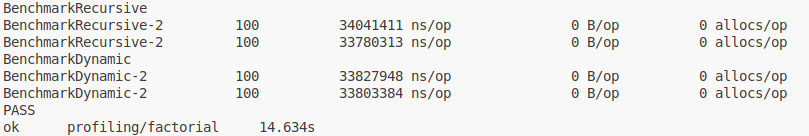
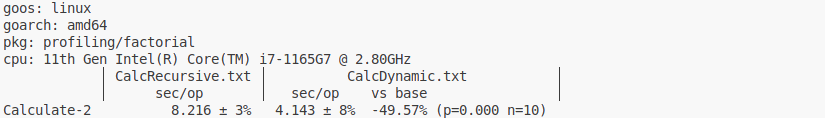

### Tools for profiling in Go 
- Benchmarks <br/>
- Profiling to file (runtime/pprof) <br/>
- Web profiling (net/http/pprof) <br/>

> go test -v ./... -bench='Benchmark(Recursive|Dynamic)' -benchmem -benchtime=100x -count=2



```
go test -v ./... -bench="BenchmarkCalculate" -run=^# -count=10 | tee CalcRecursive.txt
go test -v ./... -bench="BenchmarkCalculate" -run=^# -count=10 | tee CalcDynamic.txt
go install golang.org/x/perf/cmd/benchstat@latest
benchstat CalcRecursive.txt CalcDynamic.txt
```
