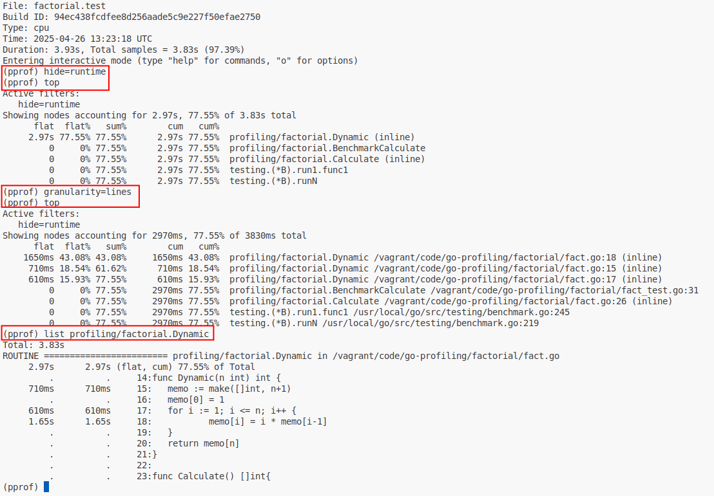
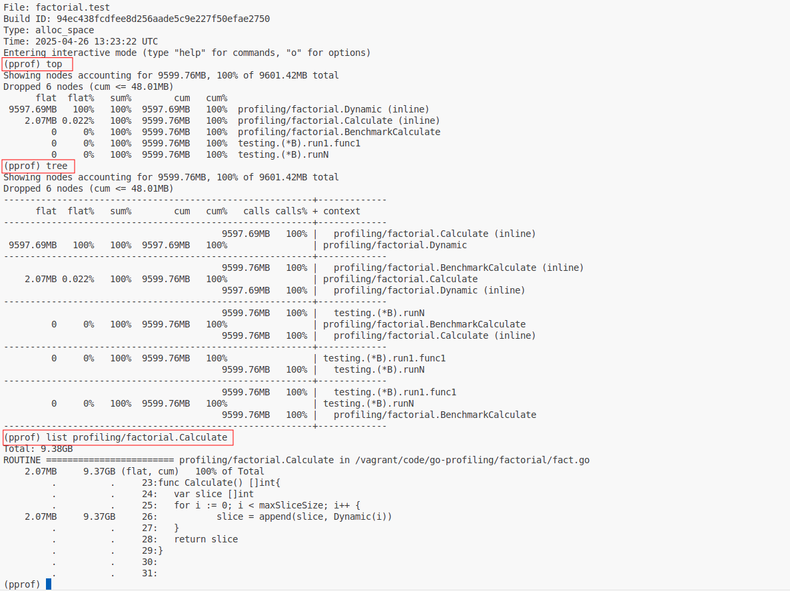
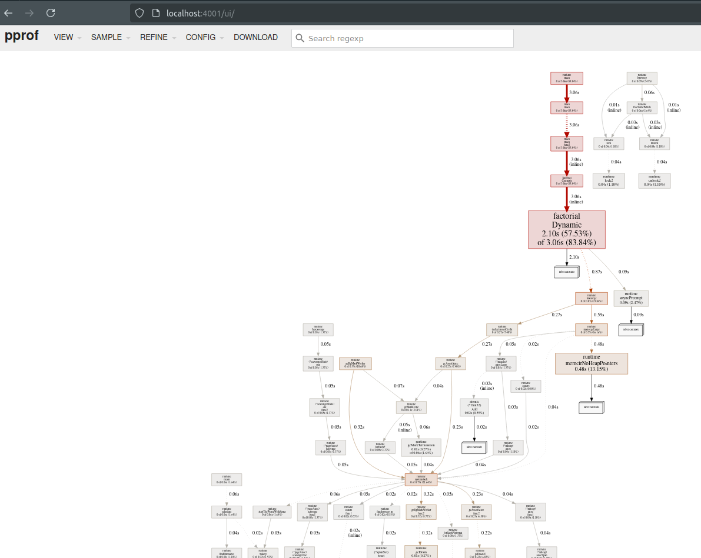
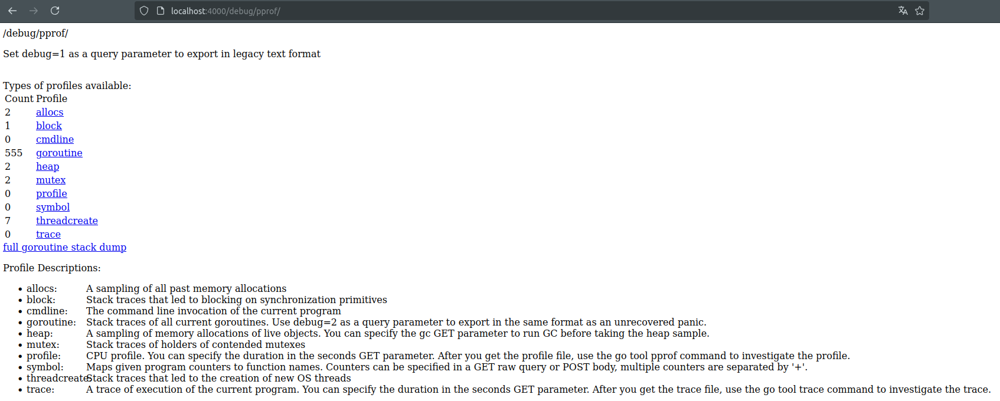
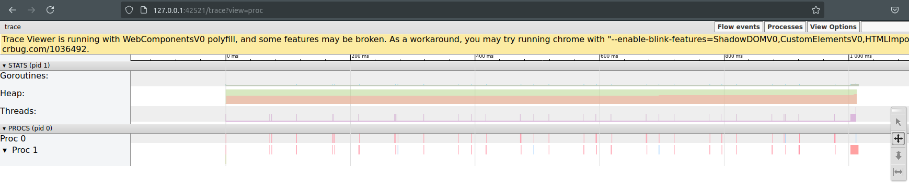

## Tools for profiling in Go 
- Benchmarks <br/>
- Profiling to file (runtime/pprof) <br/>
- Web profiling (net/http/pprof) <br/>

### Types of profiling
CPU - CPU usage of the application <br/>
Heap/Memory - memory usage by application <br/>
Goroutine - functions that create the most goroutines <br/>
Block - functions that cause the most blocking <br/>
Thread - functions that create the most threads <br/>
Mutex - functions with the highest contention for mutexes <br/>


## Benchmarks

> go test -v ./... -bench='Benchmark(Recursive|Dynamic)' -benchmem -benchtime=100x -count=2


```
go test -v ./... -bench="BenchmarkCalculate" -run=^# -count=10 | tee CalcRecursive.txt
go test -v ./... -bench="BenchmarkCalculate" -run=^# -count=10 | tee CalcDynamic.txt
go install golang.org/x/perf/cmd/benchstat@latest
benchstat CalcRecursive.txt CalcDynamic.txt
```


## Profiling to file

### Dump from benchmarks cpu.prof and mem.prof for analyze
> go test -v ./... -bench="BenchmarkCalculate" -cpuprofile='cpu.prof' -memprofile='mem.prof'

### To analyze from the console, use
> go tool pprof cpu.prof



> go tool pprof mem.prof



### Dump cpu.prof and mem.prof for analyze from file
> go run cmd/fileprofile/*

### To analyze from the web interface, use
> go tool pprof -http=0.0.0.0:4000 cpu.prof



### You can compare two profiles
> go tool pprof -http=0.0.0.0:4000 -diff_base cpu.prof cpu_1.prof

### Things to watch
```
runtime.mallogc - see what data can avoid allocate <br/>
runtime.growslice - maybe you need to set up a capacity for slices <br/>
syscall.Read or syscall.Read - maybe you need to use buffering <br/> 
```
## Profiling in real time
> import _ "net/http/pprof"
> go run cmd/netprofile/*
> http://localhost:4000/debug/pprof



You can download trace and other data and execute for example
> go tool trace trace.out



Or you can load data in browse (don't forget change port in http.ListenAndServe) <br/> 
```
Cpu 
go tool pprof -http=0.0.0.0:4000 http://localhost:4001/debug/pprof/profile

Heap
go tool pprof -http=0.0.0.0:4000 http://localhost:4001/debug/pprof/heap

Mutex 
go tool pprof -http=0.0.0.0:4000 http://localhost:4001/debug/pprof/mutex

Block
go tool pprof -http=0.0.0.0:4000 http://localhost:4001/debug/pprof/block

etc.
```